[github](https://github.com/atharva169)

> Developer & Creator  
> Building tools for governance, agriculture, and management.

I build systems that solve real-world problems. Right now I am working on 
[ai-governance-priority-engine](https://github.com/atharva169/ai-governance-priority-engine) — an AI-powered governance prioritization and accountability system. 
Also exploring building robust applications with modern web technologies.

<samp>typescript &nbsp; javascript &nbsp; react &nbsp; node &nbsp; git &nbsp; linux</samp>

**[ai-governance-priority-engine](https://github.com/atharva169/ai-governance-priority-engine)** &nbsp;·&nbsp; <samp>typescript</samp> 
AI-powered governance prioritization and accountability system (Digital Democracy).

**[Krishimitra](https://github.com/atharva169/Krishimitra)** &nbsp;·&nbsp; <samp>typescript</samp> 
An agricultural assistant to help farmers.

**[BuildAtlas](https://github.com/atharva169/BuildAtlas)** &nbsp;·&nbsp; <samp>javascript</samp> 
A project built with JavaScript.

**[AAkar](https://github.com/atharva169/AAkar)** &nbsp;·&nbsp; <samp>javascript</samp> 
AI Booth Management system (Forked).

Every graphic here is generated, not embedded from anyone else's server. ascii.svg is a photo pushed through a character ramp; the stat graphics and these section headings are drawn by a scheduled action straight from the GitHub GraphQL API, once a day, committing only what changed.

The typeface is JetBrains Mono, subset to just the characters each graphic draws and inlined as base64. That isn't only for looks: the portrait's grid assumes an advance width of exactly 0.600 em, and a viewer whose default monospace is narrower would otherwise see it squeezed.
